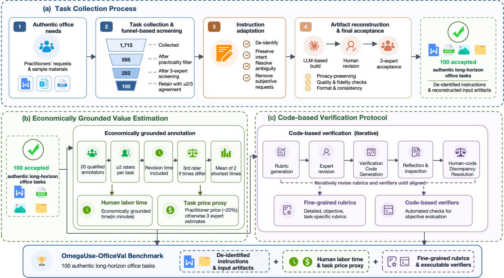

# OmegaUse-OfficeVal

[简体中文](README_zh-CN.md)

<p align="center">
  <a href="https://omegause-officeval.github.io/"><strong>Website</strong></a> &nbsp;•&nbsp;
  <a href="https://huggingface.co/datasets/baidu-frontier-research/OmegaUse-OfficeVal"><strong>Dataset</strong></a> &nbsp;•&nbsp;
  <a href="https://arxiv.org/abs/2607.27155"><strong>Paper</strong></a>
  <br>
  <a href="https://github.com/baidu-frontier-research/OmegaUse-OfficeVal"><strong>Source</strong></a> &nbsp;•&nbsp;
  <a href="https://github.com/baidu-frontier-research/OmegaUse-OfficeVal/issues"><strong>Issues</strong></a> &nbsp;•&nbsp;
  <a href="https://github.com/baidu-frontier-research/OmegaUse-OfficeVal/releases"><strong>Releases</strong></a>
</p>


OmegaUse-OfficeVal is a Python framework for securely validating, executing,
and aggregating 100 Office document evaluators. It accepts a ZIP submission,
checks its structure before extraction, runs each verifier in an isolated
subprocess, and writes machine-readable JSON and CSV reports.

> This repository contains the evaluation framework and verifier source code.
> Benchmark data is distributed separately through the linked Dataset; user
> submissions and generated evaluation workspaces are never distributed.


## Benchmark Framework

OmegaUse-OfficeVal combines authentic long-horizon Office task collection,
economically grounded value estimation, and iterative code-based verification.
The resulting benchmark pairs de-identified instructions and input artifacts
with fine-grained rubrics and executable verifiers.

<p align="center">
  
</p>

## Features

- Secure ZIP validation, including traversal, encryption, size, count, and
  compression-ratio checks.
- A uniform `evaluate(directory: str) -> dict` contract for verifiers
  `officeval_001` through `officeval_100`.
- Isolated subprocess execution with configurable concurrency and timeout.
- Visible progress, active verifier IDs, execution channel, and elapsed time.
- Atomic JSON and CSV reports with one result per verifier.
- Cross-platform normal mode for 91 verifiers.
- A serialized Office COM channel on Windows for verifiers `001`, `008`,
  `019`, `022`, `023`, `030`, `039`, `074`, and `081`.


## Requirements

- Python 3.10 or newer.
- Windows, macOS, or Linux for normal-mode verification.
- Microsoft Office on Windows only when the nine COM-required verifiers must
  run.

## Platform Compatibility

| Platform | Normal mode | Office COM | Continuous integration |
| --- | --- | --- | --- |
| Windows | Supported | Supported for nine designated verifiers when Microsoft Office is installed | Tested on Python 3.10 and 3.12 |
| Linux | Supported | Not available; COM-required verifiers are skipped in `auto` mode | Tested on Ubuntu with Python 3.10 and 3.12 |
| macOS | Expected to work | Not available; COM-required verifiers are skipped in `auto` mode | Not currently covered by CI |

Normal-mode support is based on static document parsing. Platform-specific
Office rendering and COM automation are available only on Windows.

## Installation


```bash
python -m venv .venv
```

On Linux or macOS:

```bash
source .venv/bin/activate
python -m pip install -e ".[test]"
```

On Windows PowerShell:

```powershell
.\.venv\Scripts\Activate.ps1
python -m pip install -e ".[test]"
```

`pywin32` is selected automatically on Windows and is not installed on other
platforms.

## Submission Layout

A complete submission is a ZIP archive whose root contains the 100 task
directories `officeval_001/` through `officeval_100/`:

```text
officeval_001/
officeval_002/
...
officeval_100/
```

Missing task directories are reported as warnings rather than fatal archive
errors. If the user confirms evaluation, a missing directory, an empty
directory, or a directory without a supported document does not enter its
verifier and receives a normal dimension-one failure with zero score and
`0.0%` completion.

Supported document extensions are:

- Word: `.docx`
- Excel: `.xlsx`, `.xlsm`
- PowerPoint: `.pptx`
- PDF: `.pdf`

Legacy Office formats `.doc`, `.xls`, and `.ppt` are not supported. They depend
on platform-specific conversion components and cannot provide consistent
behavior across Windows, macOS, and Linux. Unexpected content is reported by
validation but never deleted.


## Usage

```bash
omegause-officeval --package /absolute/path/to/submission.zip
```

Equivalent module entry points are available:

```bash
python -m omegause_officeval --package /absolute/path/to/submission.zip
python -m core --package /absolute/path/to/submission.zip
```

Common options:

```text
--max-workers N
--timeout-seconds SECONDS
--com-mode auto|enabled|disabled
```

COM modes affect verifiers `001`, `008`, `019`, `022`, `023`, `030`, `039`,
`074`, and `081`:

- `auto`: enable COM for those verifiers on Windows and skip them elsewhere.
- `enabled`: require Windows and enable COM for those verifiers.
- `disabled`: skip those nine verifiers on every platform.

Verifier `011` keeps a controlled COM fallback, but the scheduler always runs
it in normal mode with that fallback disabled. Other verifiers do not start
Office COM.


After validation, the CLI displays Fatal and Warning issues and asks for
explicit confirmation before evaluation starts.

## Output

Each submission creates a job-specific directory under `results/`:

```text
job.json
validation_report.json
summary.json
summary.csv
details.csv
001.json
...
100.json
```

The local `results/`, `submissions/`, and `workspaces/` directories are runtime
state and are ignored by Git. See [Result Format](docs/result-format.md) for
field definitions, status semantics, scoring rules, and missing-deliverable
handling.


## Workspace Cleanup

Extracted files remain under `workspaces/<job_id>/` after evaluation so they can
be inspected. Use the cleanup module to reclaim disk space:

```bash
# List eligible jobs, status, modification time, and estimated space only
python -m core.cleanup --list

# Delete one completed job workspace
python -m core.cleanup --job-id "<job_id>"

# Delete terminal-state workspaces older than 30 days
python -m core.cleanup --older-than-days 30
```

Deletion commands display their targets and require an explicit `y` or `yes`.
Only `workspaces/<job_id>/` is removed. The archived submission under
`submissions/<job_id>/` and JSON/CSV reports under `results/<job_id>/` remain.
Running or unknown-status jobs, symbolic links, and directory junctions are
skipped.

## Development

```bash
python -m compileall -q core verifiers omegause_officeval
python -m pytest
python -m build
```

See [Architecture](docs/architecture.md),
[Verifier Contract](docs/verifier-contract.md),
[Result Format](docs/result-format.md), and
[Security Model](docs/security.md) for implementation details.


## Contributing

Read [CONTRIBUTING.md](CONTRIBUTING.md) before opening an issue or pull
request. Please report security issues according to [SECURITY.md](SECURITY.md)
rather than through a public issue.

## License

Licensed under the [Apache License 2.0](LICENSE). See [NOTICE](NOTICE) for
attribution information and [Third-Party Licenses](THIRD_PARTY_LICENSES.md) for
dependency terms.
